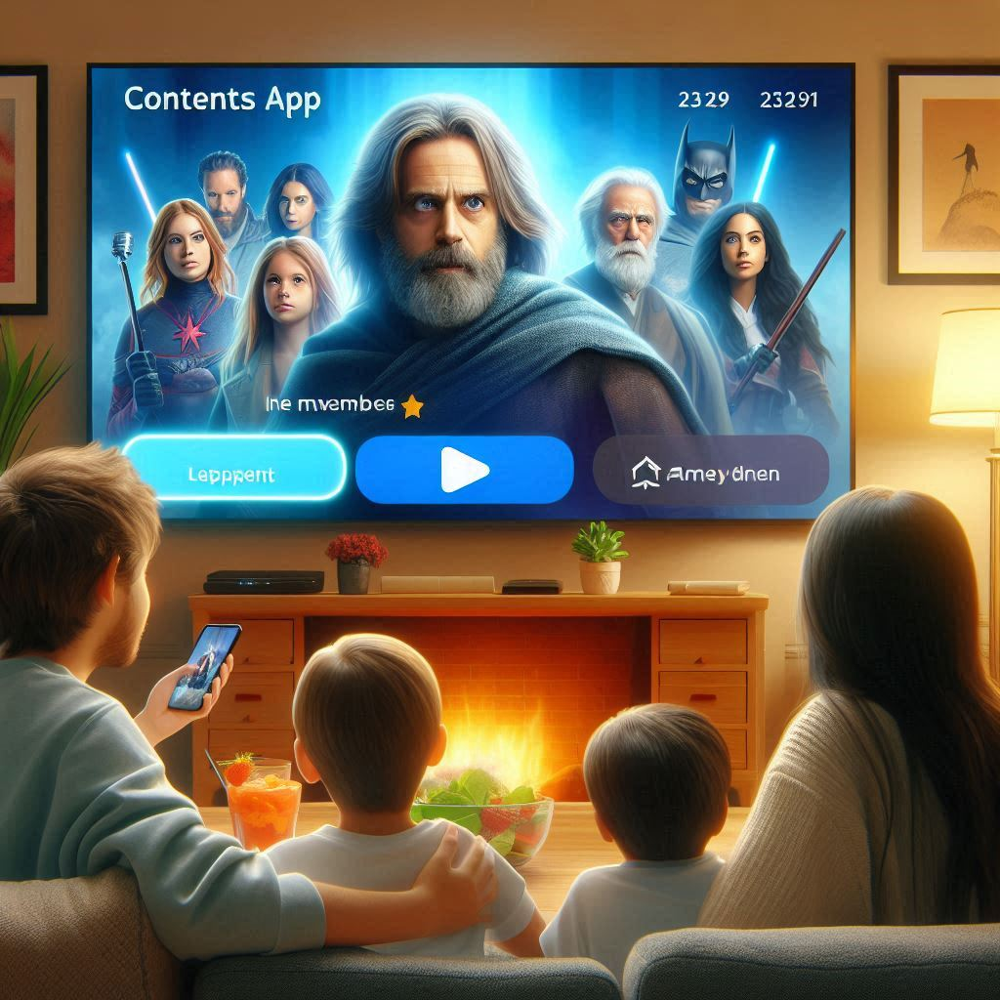

# Django Contents App

This project is a Django web application built as part of a university course.  
It implements a content management system with movies, users, actors, and watching history.

## Features
- Homepage with navigation
- Query results page (using SQL views in `view_queries.sql`)
- Add Actor form (with validation rules)
- Movie feedback form (user ratings and watch logs)
- Static files (CSS + image for homepage)

<pre> ```text django-contents-app/ ├─ Contents_App/ # Django app (models, views, urls) ├─ templates/ # HTML templates ├─ static/ # CSS and image files ├─ view_queries.sql # SQL views for queries ``` </pre>

## Requirements
- Python 3.10+
- Django 4.2+

## SQL Views
The file `view_queries.sql` contains the SQL views used in the application.
